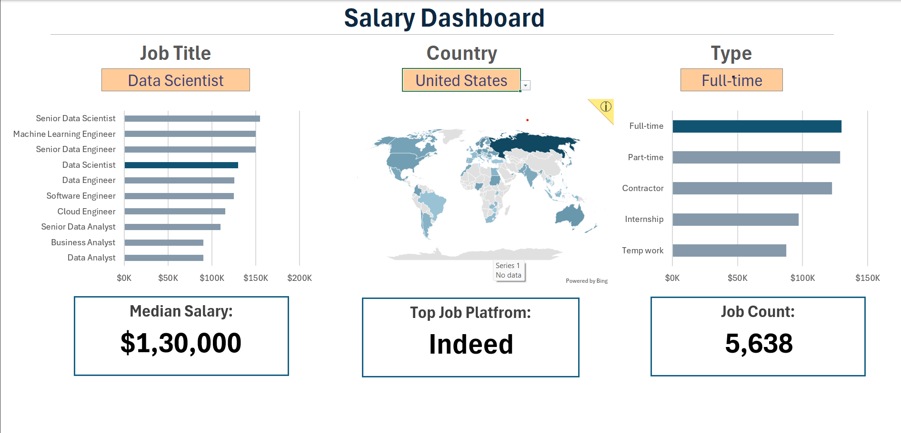

# 📊 Excel Salary Dashboard

An interactive **Salary Dashboard** built in **Microsoft Excel**, designed to visualize and analyze salary insights across various **job roles, countries, and job types**.

---

## 🧠 Project Overview
This project aims to explore salary data from multiple job roles and regions to identify patterns, trends, and key performance indicators (KPIs).  
It provides a quick snapshot of how salaries vary based on **role, location, and job type**, allowing users to make informed career or business decisions.

---

## 🔍 Key Features
- 💰 Displays **Median and Average Salary**
- 🌍 **Country-wise Salary Distribution (Map View)**
- 💼 **Top Job Platform** and **Job Count**
- 📈 Compare multiple job roles like *Data Analyst, Data Scientist, Engineer,* and more
- ⚙️ **Dynamic selection** using **Data Validation** and **Formulas**

---

## 🧰 Tools & Techniques Used
- **Microsoft Excel**
  - Charts & Graphs  
  - Data Validation  
  - Dynamic Formulas (e.g., `AVERAGE`, `MEDIAN`, `IF`, `INDEX-MATCH`)
  - Conditional Formatting  

---

## 📸 Dashboard Preview 

